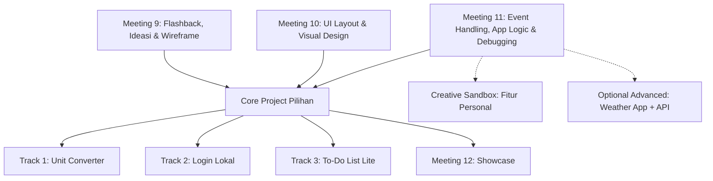

# Rencana Implementasi Revisi: Resolusi Feedback Pengajar (Level 2 & Level 3 B2C Python)

**Versi 2.1 — SSOT1 Alignment + Core Project / Optional API Extension**  
**Status:** Rencana revisi untuk review sebelum perubahan deck

Dokumen ini merespons tiga feedback utama pengajar:

1. Visual hasil GUI Level 3 belum konsisten dan belum selalu memberi gambaran hubungan antara kode, widget, dan output.
2. Proyek akhir Level 3 terlalu diarahkan ke satu hasil yang sama sehingga ruang eksplorasi siswa terbatas.
3. Materi Level 2 terlalu padat dan memiliki slide yang berulang sehingga waktu hands-on berkurang.

**Keputusan penting versi ini:** Weather App dan materi API **tidak dihapus**. Keduanya dipertahankan sebagai **Optional Advanced Extension / Teacher Reference**, sedangkan jalur proyek inti tetap mengikuti lesson plan SSOT1 agar semua siswa dapat menyelesaikan proyek tanpa API, internet, atau API key.

---

## 1. Ringkasan Diagnosa dan Resolusi

### 1.1 Level 3 — Visualisasi GUI

**Masalah nyata:**

- Deck sudah memiliki beberapa komponen `.mock-window`, tetapi penggunaannya belum konsisten.
- Tidak semua konsep baru memiliki expected output yang jelas.
- Hubungan antara kode (`CTkEntry`, `command`, `.get()`, `.configure()`) dan perubahan tampilan belum selalu terlihat.
- Visual Weather App sudah cukup kuat, tetapi terlalu dominan di bagian proyek akhir.

**Resolusi:**

- Pertahankan dan standarkan `.mock-window` yang sudah ada.
- Jangan membuat sistem CSS mockup kedua.
- Tambahkan visual secara selektif: minimal satu visual untuk konsep inti dan satu preview output per meeting.
- Pertahankan preview Weather App sebagai contoh advanced, bukan menghapusnya.

### 1.2 Level 3 — Proyek Akhir dan Ruang Eksplorasi

**Masalah nyata:**

- Meeting 9–11 saat ini terlalu mengarahkan siswa ke alur Task Manager lalu Weather App.
- Siswa belum cukup banyak mengambil keputusan sendiri mengenai masalah, target pengguna, layout, warna, dan fitur.
- Lesson plan SSOT1 menetapkan Meeting 9 sebagai brainstorming/wireframing, Meeting 10 sebagai UI layout, dan Meeting 11 sebagai app logic/debugging.
- API memang sudah diajarkan di deck, tetapi belum tercantum sebagai kompetensi wajib di lesson plan SSOT1.

**Resolusi:**

- Kembalikan jalur proyek inti ke tiga pilihan yang sesuai SSOT1:
  1. Unit Converter;
  2. Login & Verification System lokal;
  3. To-Do List Lite.
- Jadikan Weather App dengan API sebagai **Optional Advanced Extension**, bukan proyek wajib.
- Pertahankan materi API sebagai jalur lanjutan pada Meeting 11, setelah siswa menyelesaikan core app logic.
- Ubah pola dari “semua siswa membuat aplikasi yang sama” menjadi:
  - `Core Mission` yang wajib dan terukur;
  - `Creative Sandbox` untuk personalisasi;
  - `Optional Advanced Mission` untuk siswa yang siap.

### 1.3 Level 2 — Beban Slide dan Redundansi

**Masalah nyata:**

- Meeting 1–9 saat ini memiliki sekitar 45 slide per meeting.
- Sebagian slide mengulang analogi atau ringkasan tanpa aktivitas baru.
- Pemangkasan langsung ke 18–22 slide berisiko menghilangkan scaffolding, latihan, dan debugging.

**Resolusi:**

- Lakukan pilot pada Level 2 Meeting 1 terlebih dahulu.
- Klasifikasikan fungsi setiap slide sebelum menghapusnya.
- Gunakan target awal **30–36 slide efektif**, bukan angka kaku.
- Ukur keberhasilan dengan alokasi waktu dan aktivitas siswa:
  - pengantar/konsep maksimal 30%;
  - hands-on minimal 60%;
  - penutup/refleksi sekitar 10%.

---

## 2. Fase 0 — Curriculum, Safety, dan Asset Audit

Fase ini wajib dilakukan sebelum melakukan perubahan besar pada deck.

### 2.1 Penyelarasan Level 3 terhadap SSOT1

| Pertemuan | Arah SSOT1 | Kondisi deck saat ini | Keputusan implementasi |
|---|---|---|---|
| **Meeting 9** | Flashback, brainstorming, scope, wireframe, dan perencanaan alur proyek | Task Manager, dynamic widget, `.destroy()`, dan lambda capture menjadi fokus utama | Jadikan ideasi dan wireframing sebagai jalur utama. Materi dynamic widget, `.destroy()`, dan lambda dipindahkan ke bonus/advanced extension bila tetap dipertahankan. |
| **Meeting 10** | Pengerjaan proyek 1: UI layouting | Weather App front-end yang cukup spesifik | Ubah menjadi UI layout generik berdasarkan wireframe siswa. Weather display tetap tersedia sebagai contoh optional. |
| **Meeting 11** | Pengerjaan proyek 2: app logic dan debugging | Weather API, `requests`, JSON, dan `fetch_weather()` | Jadikan core path sebagai input → process → output + validation. Letakkan API/JSON sebagai Optional Advanced Extension setelah core selesai. |
| **Meeting 12** | Showcase dan presentasi final | Terlalu banyak referensi Weather/Task Manager | Generalisasi showcase untuk semua proyek. Siswa API boleh mempresentasikan integrasi API sebagai fitur lanjutan. |

### 2.2 Keputusan Scope API

API tidak dihapus dari program. Statusnya ditetapkan sebagai berikut:

- **Core requirement:** tidak membutuhkan API atau koneksi internet.
- **Optional Advanced Extension:** Weather App/API boleh dipilih oleh siswa yang sudah menyelesaikan core atau membutuhkan tantangan tambahan.
- **Teacher reference:** implementasi Weather App lengkap tetap dapat digunakan guru sebagai demo integrasi GUI + API.
- **Deck labeling:** semua materi API harus diberi label eksplisit `Optional Advanced Mission` atau `Teacher Reference`.

### 2.3 Safety dan Offline Guardrails

- [ ] Tidak ada API key, token, password, atau credential yang tertanam di HTML/JavaScript/source publik.
- [ ] Core project dapat selesai tanpa internet.
- [ ] Optional API project menggunakan API key lokal melalui environment variable atau konfigurasi privat, bukan ditulis di deck.
- [ ] Tersedia mock JSON atau contoh response lokal untuk demonstrasi offline.
- [ ] Kegagalan API ditangani dengan pesan yang ramah, bukan crash.
- [ ] Asset penting tidak hanya bergantung pada URL remote.
- [ ] Preview GUI tetap tampil walaupun API tidak tersedia.
- [ ] Materi membedakan API sungguhan dari data/mock response.
- [ ] Penjelasan teknis `.destroy()` tidak menyatakan bahwa widget pasti langsung dihapus dari RAM; jelaskan bahwa widget dilepas dari hierarchy/interface dan memory dikelola oleh Python runtime.

### 2.4 Catatan Durasi SSOT1

Lesson plan SSOT1 mencantumkan **durasi per sesi 60 menit**, tetapi rincian setiap pertemuan menggunakan alokasi **90 menit**. Sebelum lesson plan dan deck difinalkan, durasi ini harus dikonfirmasi dan diseragamkan karena akan memengaruhi:

- jumlah slide;
- kedalaman latihan;
- target proyek Meeting 9–11;
- proporsi hands-on.

Sampai dikonfirmasi, rencana implementasi menggunakan proporsi waktu, bukan angka durasi absolut.

---

## 3. Model Proyek Akhir Level 3: Core + Creative Sandbox + Optional API

### 3.1 Alur Umum



### 3.2 Core Track 1 — Unit Converter

**Contoh:** Celsius–Fahrenheit, kilometer–meter, atau kilogram–gram.

**Komponen yang dapat digunakan:**

- `CTkLabel` untuk judul, instruksi, dan hasil;
- `CTkEntry` untuk input;
- `CTkButton` atau `CTkOptionMenu` untuk pilihan;
- function untuk proses konversi;
- `try-except ValueError` untuk input non-angka.

**Core MVP:**

- menerima angka;
- memproses rumus;
- menampilkan hasil berformat;
- menampilkan pesan error jika input tidak valid.

**Creative Sandbox:**

- menambah pilihan satuan;
- dark/light mode;
- warna hasil berubah sesuai kondisi;
- tombol reset;
- riwayat konversi sederhana.

### 3.3 Core Track 2 — Login & Verification System Lokal

**Komponen yang dapat digunakan:**

- `CTkLabel`;
- `CTkEntry` untuk username dan password;
- `show="*"` untuk menyamarkan password;
- `CTkButton` untuk login dan clear;
- label status.

**Core MVP:**

- memeriksa input kosong;
- mencocokkan data contoh menggunakan dictionary atau `if/else`;
- menampilkan status berhasil/gagal;
- memiliki tombol reset/clear.

**Batasan penting:**

- ini adalah simulasi login lokal untuk pembelajaran GUI;
- bukan sistem keamanan sungguhan;
- jangan menggunakan credential pribadi siswa;
- jangan menyimpan password sungguhan atau mengklaim bahwa hardcoded password aman.

**Creative Sandbox:**

- tombol show/hide password;
- batas tiga kali percobaan;
- pesan status berbeda;
- tema “brankas”, “portal”, atau “game login”.

### 3.4 Core Track 3 — To-Do List Lite

**Komponen yang dapat digunakan:**

- `CTkEntry` untuk input tugas;
- `CTkButton` untuk tambah dan reset;
- `CTkLabel` atau `CTkTextbox` untuk area daftar;
- Frame untuk mengelompokkan area input dan output.

**Core MVP:**

- memasukkan teks tugas;
- menampilkan tugas pada area daftar;
- validasi input kosong;
- reset/clear daftar.

**Creative Sandbox / To-Do Pro optional:**

- checkbox dinamis;
- hapus tugas per item;
- `CTkScrollableFrame`;
- kategori tugas;
- prioritas atau warna status.

Konsep dynamic widget, `.destroy()`, dan lambda callback dapat ditempatkan di sini sebagai tantangan lanjutan, bukan syarat semua siswa.

### 3.5 Optional Advanced Mission — Weather App dengan API

Weather App dipertahankan sebagai jalur lanjutan karena menggabungkan GUI, event handling, data eksternal, dan visual display.

**Core optional flow:**

```text
Entry kota
→ tombol Search
→ requests.get()
→ response JSON
→ ambil data dari dictionary/list
→ update label/icon
→ tampilkan error jika gagal
```

**Komponen:**

- search entry;
- tombol Search;
- label nama kota;
- label suhu dan kondisi;
- weather icon/image;
- status error/loading;
- optional humidity/wind speed.

**Syarat sebelum mengambil jalur ini:**

- siswa sudah menyelesaikan core UI;
- siswa memahami `.get()`, function, `command`, `.configure()`, dan `try-except`;
- guru menyediakan mock response/offline fallback;
- API key tidak ditulis di deck atau repository publik.

**Pilihan personalisasi:**

- nama aplikasi;
- tema warna;
- layout weather card;
- kota favorit;
- informasi humidity/wind speed;
- ikon cuaca;
- tombol reset;
- riwayat pencarian;
- pesan rekomendasi pakaian atau aktivitas.

Weather App tidak lagi diposisikan sebagai hasil yang harus dibuat semua siswa.

---

## 4. Rencana Meeting 9–12 Level 3

### Meeting 9 — Flashback, Ideation & Wireframing

**Fokus utama:** menghasilkan proposal proyek yang realistis.

Setiap siswa menyelesaikan:

- nama aplikasi;
- masalah atau kebutuhan pengguna;
- target pengguna;
- pilihan core track;
- tiga fitur Core MVP;
- satu sampai tiga fitur Creative Sandbox;
- wireframe UI;
- alur input → process → output;
- daftar asset yang diperlukan;
- kemungkinan error dan cara menanganinya;
- milestone Meeting 10 dan Meeting 11.

Weather App boleh dipilih sebagai **Optional Advanced Mission**, tetapi siswa tetap harus menentukan versi personalnya dan tidak sekadar menyalin aplikasi guru.

**Bukti keberhasilan:** proposal dan wireframe telah disetujui guru.

### Meeting 10 — UI Layout & Visual Design

**Fokus utama:** menerjemahkan wireframe menjadi tampilan GUI.

Semua siswa minimal memiliki:

- root window;
- judul aplikasi;
- layout utama;
- widget input;
- widget output;
- tombol aksi;
- identitas visual berupa warna, font, atau label personal.

Untuk siswa jalur Weather, display cuaca boleh dibuat sebagai mockup/statis terlebih dahulu. Tombol dan API belum wajib berfungsi pada tahap ini.

**Bukti keberhasilan:** UI dapat dijalankan dan terlihat sesuai wireframe, walaupun logic belum lengkap.

### Meeting 11 — Event Handling, App Logic & Debugging

**Core path:**

- mengambil input dengan `.get()`;
- memproses data dengan rumus atau `if/else`;
- mengubah output dengan `.configure()`;
- memvalidasi input kosong;
- menggunakan `try-except` jika relevan;
- melakukan minimal tiga test case;
- memperbaiki minimal satu bug.

**Optional API path:**

- mengambil input kota;
- membentuk request;
- membaca JSON;
- menampilkan nilai API ke label/image;
- menangani koneksi gagal, kota tidak ditemukan, dan input kosong;
- memakai mock response jika internet/API tidak tersedia.

**Bukti keberhasilan:** core MVP berfungsi. Fitur API dihitung sebagai bonus, bukan syarat kelulusan.

### Meeting 12 — Showcase & Presentasi Final

Presentasi berlaku untuk semua track. Siswa menjelaskan:

- masalah yang ingin diselesaikan;
- target pengguna;
- wireframe awal;
- tiga fitur MVP;
- demo aplikasi;
- satu keputusan desain;
- satu bug yang diperbaiki;
- satu fitur lanjutan yang ingin ditambahkan.

Siswa yang menggunakan API dapat menjelaskan:

- data apa yang diambil;
- alur request → response → GUI;
- apa yang terjadi jika API gagal.

Siswa yang tidak menggunakan API tetap dinilai setara berdasarkan kualitas logika, UI, testing, kreativitas, dan presentasi.

---

## 5. Normalisasi Visual GUI Level 3

Gunakan `.mock-window` yang sudah ada di `level3/deck.html`. Jangan membuat sistem CSS preview kedua.

### Standar visual

1. Title bar konsisten dengan judul aplikasi.
2. Variant dark dan light memiliki kontras yang cukup untuk proyektor.
3. Preview diberi label `Preview Tampilan GUI`.
4. Bila visual hanya mockup HTML, jangan menyebutnya sebagai screenshot runtime.
5. Visual tidak bergantung pada API atau gambar remote untuk dapat dirender.

### Penempatan visual

- **Konsep baru:** satu visual yang menghubungkan konsep dengan output.
- **Latihan/coding:** satu expected output yang harus dicapai siswa.
- **Meeting 9:** wireframe dan contoh scope proyek.
- **Meeting 10:** preview UI sebelum logic.
- **Meeting 11:** perbandingan state sebelum/sesudah tombol ditekan.
- **Optional API:** diagram `Entry → Request → JSON → GUI` dan state error/offline.
- **Meeting 12:** template preview untuk berbagai jenis proyek, bukan hanya Weather.

---

## 6. Rencana Pilot Level 2 — Meeting 1 First

### Langkah pilot

1. Inventarisasi 45 slide dan beri label:
   - `Review`;
   - `Concept`;
   - `Analogy`;
   - `Visual Model`;
   - `Live Demo`;
   - `Guided Exercise`;
   - `Bug Hunt`;
   - `Independent Exercise`;
   - `Reflection/Closing`.
2. Tandai slide yang hanya mengulang isi tanpa fungsi belajar baru.
3. Gabungkan flashback pasif menjadi active-recall challenge.
4. Gabungkan analogi yang menjelaskan konsep sama menjadi satu visual.
5. Pasangkan method yang memang layak dibandingkan, tanpa menghilangkan contoh penting.
6. Pertahankan latihan terbimbing, bug hunt, independent exercise, dan answer reveal.
7. Evaluasi hasil pada kisaran **30–36 slide efektif**.
8. Validasi dengan tolok ukur waktu:
   - konsep/pengantar maksimal 30%;
   - hands-on minimal 60%;
   - refleksi/penutup sekitar 10%.
9. Setelah Meeting 1 direview pengajar, baru rollout ke Meeting 2–9.

Tidak ada kewajiban angka 18–22 slide sebelum hasil pilot dan feedback pengajar tersedia.

---

## 7. Deliverable Lesson Plan

Pembuatan atau revisi lesson plan dilakukan sebagai artefak terpisah dari student deck.

### `level3/lesson_plan_level3.html`

Harus memuat:

- expected output setiap meeting;
- annotated wireframe dan hierarki widget;
- perbedaan Core Mission, Creative Sandbox, dan Optional API Mission;
- penjelasan `mainloop()`, `command=fungsi`, `.get()`, `.configure()`, dan `try-except`;
- panduan offline/mock response untuk API;
- troubleshooting CustomTkinter;
- minimum goal, support, dan bonus challenge;
- acceptance criteria per meeting.

### `level2/lesson_plan_level2.html`

Harus memuat:

- alokasi waktu pilot;
- alasan penggabungan/penghapusan slide;
- kunci jawaban Bug Hunt;
- diagnosis kesalahan index/list/string;
- panduan menjaga hands-on tetap dominan.

Catatan guru, timing rinci, dan jawaban reasoning tidak dimasukkan ke student deck.

---

## 8. Acceptance Criteria dan QA

### Visual Level 3

- [ ] Guru dapat memahami posisi dan fungsi widget dari preview.
- [ ] Setiap meeting 1–8 memiliki minimal satu expected-output visual yang relevan.
- [ ] Meeting 9–12 memiliki visual yang mendukung proyek pilihan siswa.
- [ ] Preview dapat dirender tanpa internet.
- [ ] Kontras dan ukuran teks aman untuk proyektor.
- [ ] Tidak ada sistem CSS mockup duplikat.

### Core Final Project

- [ ] Siswa memiliki nama aplikasi dan target pengguna sendiri.
- [ ] Siswa memiliki minimal tiga fitur Core MVP.
- [ ] Aplikasi menerima input, memprosesnya, dan menampilkan output.
- [ ] Terdapat validasi input atau error handling yang relevan.
- [ ] Siswa menjalankan minimal tiga test case.
- [ ] Siswa dapat menjelaskan satu bug dan perbaikannya.
- [ ] Siswa memiliki minimal satu ide Creative Sandbox.

### Optional API Project

- [ ] API ditandai sebagai optional, bukan syarat semua siswa.
- [ ] Tidak ada API key/token di deck atau repository publik.
- [ ] Ada mock response/offline fallback.
- [ ] Error koneksi, input kosong, dan data tidak ditemukan ditangani.
- [ ] Siswa dapat menjelaskan alur request → response → GUI.
- [ ] Fitur API tidak menjadi dasar penilaian yang merugikan siswa core path.

### Level 2

- [ ] Pengantar maksimal 30% waktu kelas.
- [ ] Hands-on minimal 60% waktu kelas.
- [ ] Tidak ada dua slide berturut-turut yang mengulang ide identik tanpa aktivitas baru.
- [ ] Semua objective tetap memiliki latihan terbimbing dan mandiri.
- [ ] Target slide ditentukan berdasarkan fungsi pedagogis, bukan kuota kaku.

### Technical and Security QA

- [ ] Semua snippet Python lulus syntax check.
- [ ] Tidak ada secret, credential, atau data pribadi.
- [ ] Tidak ada dependency remote yang menjadi syarat core lesson.
- [ ] Tidak ada broken asset penting.
- [ ] Browser console tidak memiliki error yang tidak dijelaskan.
- [ ] Tidak ada horizontal overflow pada ukuran laptop/proyektor/mobile.
- [ ] Meeting 12 tidak mengasumsikan semua siswa membuat Weather App.
- [ ] Quote dan atribusi memenuhi aturan deck yang berlaku.

---

## 9. Prioritas dan Roadmap Eksekusi

```text
P0: Audit SSOT1, deck, dan lesson plan Level 3; tetapkan Core Path vs Optional API Path.
P0: Rebuild Final Project Level 3 Meeting 9–12 tanpa menghapus Weather/API.
    - Meeting 9: ideasi dan wireframe.
    - Meeting 10: UI layout generik.
    - Meeting 11: core app logic + optional API extension.
    - Meeting 12: showcase generik.
P1: Normalisasi `.mock-window` dan tambahkan visual expected output secara selektif.
P1: Audit zero-secret, offline fallback, dan asset lokal untuk jalur core/API.
P1: Pilot perampingan Level 2 Meeting 1 pada kisaran 30–36 slide efektif.
P2: Rollout pola Level 2 ke Meeting 2–9 setelah review pengajar.
P2: Buat atau revisi lesson_plan_level3.html dan lesson_plan_level2.html.
P3: Comprehensive QA: curriculum, visual, interaction, Python syntax, offline, security, dan browser console.
```

## Keputusan Akhir

Rencana ini tidak lagi menghapus Weather App atau materi API. Keputusannya adalah:

> **Core project mengikuti SSOT1 dan harus dapat selesai offline. Weather App + API tetap dipertahankan sebagai optional advanced extension dan teacher reference.**

Dengan model ini, feedback guru tetap terjawab tanpa membuang materi API dan display yang sudah berhasil diajarkan.
